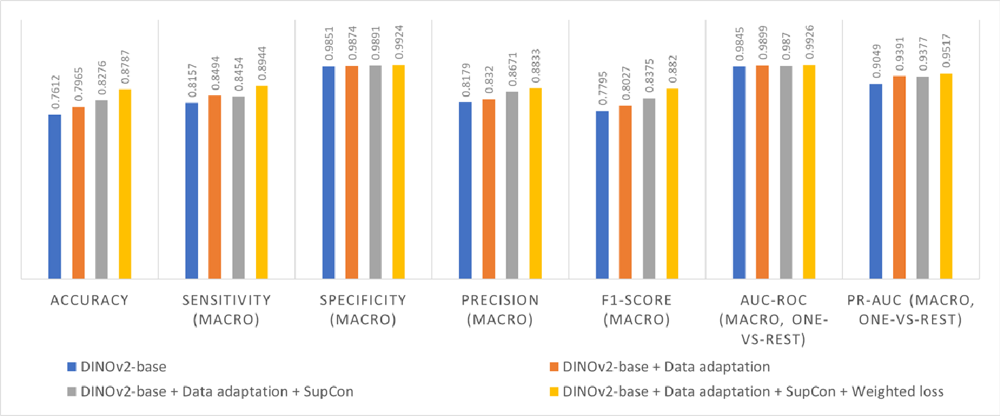
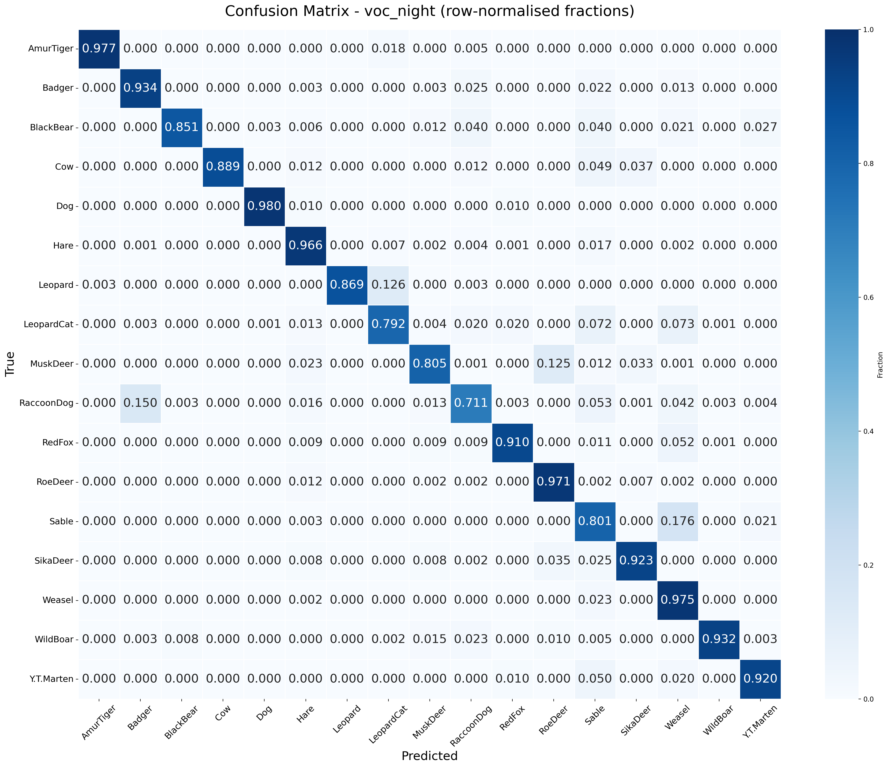
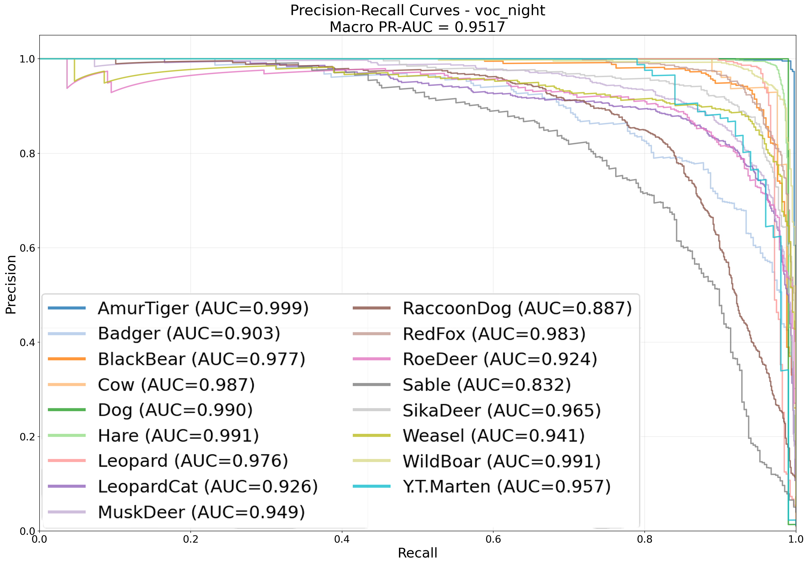
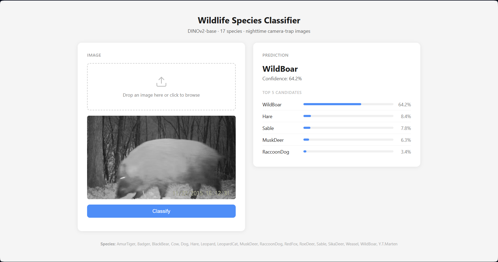

<div align="center">
  <h1>A Vision Transformer (ViT)-based Domain Adaptation Framework for Wildlife Camera-Trap Species Classification</h3>


</div>

A day-to-night domain-adaptive species identification pipeline built on `facebook/dinov2-base`. The model is trained exclusively on daytime camera-trap images and evaluated on nighttime images of the same species, without any nighttime labels being used during training.

## Table of Contents

- [Table of Contents](#table-of-contents)
- [Abstract](#abstract)
- [Project Description](#project-description)
  - [Key Components](#key-components)
  - [Project Goals](#project-goals)
- [Project Structure](#project-structure)
- [Installation](#installation)
  - [Data Installation](#data-installation)
  - [Repository Installation](#repository-installation)
- [Running the Pipeline](#running-the-pipeline)
  - [Model Training](#model-training)
  - [Inference Webapp](#inference-webapp)
- [Methodology](#methodology)
  - [Dataset Structure](#dataset-structure)
  - [Architecture](#architecture)
    - [Backbone:](#backbone)
    - [Workflow:](#workflow)
- [Results](#results)
  - [Evaluation Metrics](#evaluation-metrics)
  - [Output Files](#output-files)
  - [Framework Performance](#framework-performance)
  - [Inference Demo](#inference-demo)
- [Limitations and Future Work](#limitations-and-future-work)
- [Contributing](#contributing)
- [License](#license)
- [Author](#author)
- [References](#references)


---

## Abstract

Camera-trap images collected at night differ substantially from daytime images in brightness, colour saturation, contrast, and noise characteristics. A model trained naively on daytime data often fails at night because it learns colour-dependent, illumination-specific features rather than species-level structural cues. This project presents a domain-generalisation pipeline built on a `facebook/dinov2-base` (ViT-B/14) backbone that closes this day-to-night gap through night-simulated data augmentation, supervised contrastive pretraining, and controlled partial fine-tuning. The classification results are evaluated on a 17-species camera-trap benchmark.

## Project Description

This pipeline addresses the day-to-night domain gap through three complementary mechanisms:

- **Data-level adaptation:** night-simulated augmented copies of daytime images are concatenated to the training set, exposing the model to illumination conditions closer to the test distribution.
- **Supervised Contrastive Loss:** a contrastive pretraining phase shapes the backbone toward species-discriminative, domain-robust representations before the classification head is attached.
- **Partial fine-tuning with controlled learning rates:** only the last N transformer blocks are unfrozen during fine-tuning with the classification head, protecting general low-level features learned during DINOv2 pretraining.

### Key Components

- **DINOv2 Backbone:** `facebook/dinov2-base` (ViT-B/14), fine-tuned for species classification.
- **Night Simulation:** an augmentation pipeline (CLAHE, desaturation, gamma darkening, noise, flash hotspot) that approximates nighttime conditions from daytime images.
- **Two-Phase Training Schedule:** optional SupCon contrastive pretraining phase followed by weighted cross-entropy fine-tuning.
- **Inference Webapp:** a FastAPI application for uploading an image and receiving top-5 species predictions.

### Project Goals

- Classify camera-trap species accurately at night despite training exclusively on daytime-labelled data.
- Quantify and close the domain gap using contrastive representation learning rather than requiring nighttime annotations.
- Provide a reproducible, config-driven pipeline covering training, evaluation, and inference.

## Project Structure

```plaintext
project-root/
├── app/
│   ├── app.py               # FastAPI inference server
│   └── index.html           # Inference webapp frontend
├── assets/                  # Image assets for README.md file
├── data/
│   ├── voc_day/             # Daytime images + Pascal VOC annotations (training)
│   └── voc_night/           # Nighttime images + Pascal VOC annotations (val/test)
├── outputs/                 # Checkpoints, logs, metrics, plots (created at runtime)
├── main.py                  # Single entry point: verify, train, evaluate
├── dataset.py               # Pascal VOC parser, dataset splits, MinKBatchSampler, class weights
├── data_adaptation.py       # Night-simulation transform pipeline
├── train.py                 # Dinov2Classifier, SupConLoss, training loop with phase schedule
├── evaluate.py              # Metrics computation, confusion matrix, PR-AUC plots
├── requirements.txt         # Python dependencies
└── README.md                # Project documentation
```

## Installation

### Data Installation

**1. Clone the repository:**

   ```bash
   git clone https://github.com/myyyyw/NTLNP.git
   cd NTLNP
   ```

**2. Run the downloader:**

   ```bash
   run './Download.sh'
   ```

### Repository Installation

**1. Clone the repository:**

   ```bash
   git clone https://github.com/ACM40960/nighttime-image-classification.git
   cd nighttime-image-classification
   ```

**2. Create a virtual environment:**

   ```bash
   python -m venv venv
   ```

   - **On macOS/Linux:**
     ```bash
     source venv/bin/activate
     ```
   - **On Windows:**
     ```bash
     venv\Scripts\activate
     ```

**3. Install the dependencies:**

   ```bash
   pip install -r requirements.txt
   ```

## Running the Pipeline

### Model Training

```bash
# Baseline (no adaptation)
python main.py

# With data adaptation
python main.py --use_data_adapt

# With supervised contrastive loss
python main.py --use_supcon

# Full configuration (both modules active)
python main.py \
  --use_data_adapt \
  --use_supcon \
  --epochs 30 \
  --warmup_epochs 10 \
  --finetune_blocks 3 \
  --batch_size 72 \
  --lr 1e-4 \
  --num_workers 4 \
  --data_root ./data
```

**All arguments**

| Argument | Default | Description |
|---|---|---|
| `--data_root` | `./data` | Root directory containing `voc_day/` and `voc_night/` data |
| `--epochs` | 30 | Total training epochs |
| `--warmup_epochs` | 15 | Number of allocated epochs for Phase 1 |
| `--finetune_blocks` | 3 | Number of trailing encoder blocks to unfreeze in Phase 2 |
| `--batch_size` | 76 | Batch size for training and evaluation |
| `--lr` | 1e-4 | Head learning rate |
| `--num_workers` | 4 | DataLoader worker processes (use 0 on Windows) |
| `--use_data_adapt` | off | Append night-simulated copies of daytime images to training |
| `--use_supcon` | off | Enable supervised contrastive learning schedule |

### Inference Webapp

```bash
# Inference on best checkpoint stored in output
python app/app.py --checkpoint outputs/best_model_{timestamp}.pt
```

Once the server is running, open `http://localhost:8000` and follow the inference procedure on the web interface: upload a camera-trap image and receive the top-5 predicted species with confidence scores.

## Methodology

### Dataset Structure

```plaintext
data/
├── voc_day/
│   ├── Annotations/    (*.xml, Pascal VOC format)
│   └── JPEGImages/     (*.jpg)
└── voc_night/
    ├── Annotations/    (*.xml, Pascal VOC format)
    └── JPEGImages/     (*.jpg)
```

Each XML annotation provides the species label and a bounding box `(xmin, ymin, xmax, ymax)`, used to crop the image to the animal before resizing, removing domain-sensitive background.

**Split strategy**

| Split | Source | Size | Purpose |
|---|---|---|---|
| Train | voc_day | 100% | Model training |
| Val | voc_night | 20% | Checkpoint selection per epoch |
| Test | voc_night | 80% | Final evaluation after training |

### Architecture

#### Backbone: 

The backbone uses `facebook/dinov2-base` (ViT-B/14) with 12 transformer blocks, hidden dimension 768, patch size 14x14. Input images are resized to 224x224, divided into a 16x16 grid of patches (256 tokens), and prepended with a learnable `[CLS]` token. The `[CLS]` token from the final layer serves as the global image representation.

<div align="center" style="margin:0 0 28px;">
  
  <div style="margin-top:8px;"><sub>DINOv2 architecture</sub></div>
</div>

#### Workflow:

<div align="center" style="margin:0 0 28px;">
  
  <div style="margin-top:8px;"><sub>Overall pipeline workflow</sub></div>
</div>

**Data Adaptation:** When `--use_data_adapt` is enabled, each daytime training image is also passed through a night-simulation pipeline (fixed medium strength) that applies:
 
1. CLAHE in LAB colour space (local contrast enhancement).
2. Random greyscale conversion (near-IR desaturation, p=0.5).
3. Gamma darkening (gamma in [1.2, 2.2], p=0.6).
4. Contrast compression (factor in [0.3, 0.7], p=0.5).
5. Gaussian sensor noise (std in [5, 25], p=0.6).
6. Flash hotspot overlay (Gaussian brightness increase at centre, p=0.3).

The adapted copies are concatenated with the original training images via `ConcatDataset`. Index `i` (original) and index `i + N` (adapted) always correspond to the same source image, providing implicit positive pairs.

**Batch Sampling:**
- *Without `--use_supcon`:* standard `DataLoader` with `shuffle=True` and the specified `batch_size`.
- *With `--use_supcon`:* `MinKBatchSampler` ensures every species appearing in a batch is represented by at least `MIN_K = 3` samples, guaranteeing meaningful positive pairs for every anchor (including rare species) while respecting `--batch_size` exactly. Per batch: draw `batch_size` indices from an epoch-level shuffle, then for each species with fewer than 3 representatives, replace slots from over-represented species with additional samples of the under-represented species.

**Training Schedule:**

*Without `--use_supcon` (baseline)*

| Phase | Epochs | Backbone | Trained parameters | Loss |
|---|---|---|---|---|
| 1 | 1 to `warmup_epochs` | Fully frozen | Classification head | Weighted CE |
| 2 | `warmup_epochs+1` to end | Last N blocks unfrozen | Last N blocks (lr x 0.02) + head (lr) | Weighted CE |

*With `--use_supcon`*

| Phase | Epochs | Backbone | Trained parameters | Loss |
|---|---|---|---|---|
| 1a | 1 to 5 | Fully frozen | Projection head only | SupCon |
| 1b | 6 to `warmup_epochs` | Fully unfrozen | Backbone (lr x 0.01) + projection head (lr) | SupCon |
| 2a | `warmup_epochs+1` to `warmup_epochs+5` | Fully frozen | Classification head only | Weighted CE |
| 2b | `warmup_epochs+6` to end | Last N blocks unfrozen | Last N blocks (lr x 0.02) + head (lr) | Weighted CE |

Phase 1a stabilises the projection head before the backbone receives any gradients. Phase 1b shapes the backbone representations toward species discriminability using contrastive loss. Phase 2a stabilises the randomly-initialised classification head before the backbone is partially unfrozen, and Phase 2b performs the final task-specific fine-tuning. The classification head is excluded from the optimiser during phases 1a/1b, and the projection head is excluded from Phase 2 onwards.

*Example allocation* (`--warmup_epochs 15 --epochs 30 --use_supcon`):

```
Phase 1a : epochs  1 -  5   (backbone frozen, projection head, SupCon loss)
Phase 1b : epochs  6 - 15   (full backbone, SupCon loss)
Phase 2a : epochs 16 - 20   (backbone frozen, classification head, CrossEntropy loss)
Phase 2b : epochs 21 - 30   (last N blocks, CrossEntropy loss)
```

If `warmup_epochs <= 5`, Phase 1b has zero epochs and the schedule collapses to: Phase 1a (all warmup_epochs), then Phase 2a, then Phase 2b.

**Projection head (SupCon phases 1a and 1b only):**
 
```
CLS token (768-dim) -> Linear(768, 768) -> ReLU -> Linear(768, 128) -> L2-norm
```

**Classification head (Phase 2 onwards):**
 
```
CLS token (768-dim) -> Dropout(0.3) -> Linear(768, num_classes)
```

**Loss Function:**

*Weighted Cross-Entropy:* used during all classification phases. Per-class weights are the inverse frequency of each species in the training dataset, normalised so the mean weight is 1.0:
 
```
weight_c = 1 / count_c,  normalised so mean(weights) = 1.0
```
 
Label smoothing of epsilon = 0.1 is applied to reduce overconfidence, and `weight_c` is capped at 2.5 to avoid heavy penalties on minor classes which may cause overclassification.
 
*Supervised Contrastive Loss:* used during SupCon phases. For each anchor embedding, all samples in the batch sharing the same species label are treated as positives. The loss encourages same-species embeddings to cluster together on the L2-normalised unit hypersphere while pushing apart embeddings from different species. Temperature is fixed at 0.07.

## Results

### Evaluation Metrics

Evaluation is run on the 80% test split of `voc_night` after training completes. The best checkpoint is selected by `val_night` macro-F1, evaluated after each epoch. With `--use_supcon`, only Phase 2 epochs are eligible for checkpointing, since the classification head is not trained before that point.

**Overall (macro-averaged):** accuracy, sensitivity (macro recall), specificity, precision, F1-score, AUC-ROC (one-vs-rest), PR-AUC (one-vs-rest).

**Per-species:** TP, TN, FP, FN counts; sensitivity, specificity, precision, accuracy, F1; AUC-ROC, PR-AUC.

The confusion matrix is row-normalised (fractions, not counts) so the diagonal represents per-class recall directly.

### Output Files

All output filenames include a datetime stamp `dd_mm_yy_hh_mm_ss` so successive runs never overwrite each other. All files are written to `./outputs/`.

| File | Description |
|---|---|
| `best_model_{ts}.pt` | Best checkpoint (model state, label map, args) |
| `label_map_{ts}.json` | Species name to index mapping |
| `train_log_{ts}.csv` | Per-epoch loss, accuracy, macro-F1, sub-phase label |
| `evaluation_report_{ts}.txt` | Human-readable metrics summary |
| `metrics_per_class_{ts}.csv` | Per-species metrics table |
| `confusion_matrix_{ts}.png` | Row-normalised confusion matrix heatmap |
| `confusion_matrix_{ts}.csv` | Raw confusion fractions |
| `pr_auc_{ts}.png` | Precision-recall curves (one per species + macro) |

### Framework Performance

**Model performance comparison**

<div align="center" style="margin:0 0 28px;">
  
</div>

Ablation results show consistent gains from each added component, with the **full pipeline (DINOv2-base + data adaptation + SupCon + weighted loss)** achieving the best performance across all seven metrics (Accuracy: 0.879, Macro F1: 0.882, PR-AUC: 0.952). Notably, SupCon alone produced a marginal dip in Sensitivity and AUC-ROC relative to data adaptation, yet rises in other evaluation metrics. This suggests SupCon alone may trade a bit of ranking/recall quality for better class separation, and it is the weighted loss step that recovers and surpasses it.

**Per-species analysis**

<div align="center" style="margin:0 0 28px;">
  
  <div style="margin-top:8px;"><sub>Confidence matrix</sub></div>
</div>

<div align="center" style="margin:0 0 28px;">
  
  <div style="margin-top:8px;"><sub>PR-AUC curve</sub></div>
</div>

- The model achieves high per-class recall and ranking quality (macro PR-AUC = 0.9517) overall, with 10 of 17 species classified correctly ≥93% of the time and 13 of 17 classes exceeding 0.92 PR-AUC.
- Performance is weakest for the four species: Sable, RaccoonDog, MuskDeer, and LeopardCat. This is consistent with expected difficulty in separating nocturnal species of similar size or coated at night.
- Severely imbalanced class is addressed but not fully resolved, as the weakest classes remain the ones with few daytime samples for training. Hare is the only exception with excellent classification capability despite the low number training images.

More detailed evaluation results can be found at [Output](/outputs/).

### Inference Demo

<div align="center" style="margin:0 0 28px;">
  
  <div style="margin-top:8px;"><sub>Webapp working example</sub></div>
</div>

The web application provides a prediction on a given night-vision animal image, including the top five candidates with their respective confidence scores.

## Limitations and Future Work

The framework suffers from data imbalance, as some species are more active at night resulting in few training samples. Small nocturnal animals are the hardest to distinguish among all species. Confusions between some classes should also be addressed, including Sable and Weasel, RaccoonDog and Badger, Leopard and LeopardCat, and MuskDeer and RoeDeer.

Future improvements could include accommodating more state-of-the-art backbone models, using self-supervised pre-training on unlabelled wildlife images, adding test-time adaptation, and extending the system to location-specific species priors so predictions reflect local ecology as well as image evidence. Another promising direction is sequence-level modelling, since camera traps often produce bursts of related frames and consensus or multi-image approaches can outperform single-image decisions in wildlife settings.

## Contributing

Contributions are welcome. If you would like to improve this project, please fork the repository and submit a pull request. Contributions could include new features, improved documentation, or bug fixes.

How to contribute:  
1. Fork the repository and create a new branch.  
2. Commit your changes with a clear description.  
3. Open a pull request to share your work. 

## License

This project is licensed under the MIT License - see the [LICENSE](LICENSE) file for details.

## Author

**Xuan Bach Nguyen**
-  Email: [xuan.b.nguyen@ucdconnect.ie](mailto:xuan.b.nguyen@ucdconnect.ie) and [bachnx1710@gmail.com](mailto:bachnx1710@gmail.com)
-  LinkedIn: [https://www.linkedin.com/in/xuan-bach-nguyen-178055368/](https://www.linkedin.com/in/xuan-bach-nguyen-178055368/)
-  Institution: University College Dublin, M.Sc. Data & Computational Science, 25206963

## References

1. Oquab, M., Darcet, T., Moutakanni, T., Vo, H., Szafraniec, M., Khalidov, V., ... & Bojanowski, P. (2023). Dinov2: Learning robust visual features without supervision. arXiv preprint arXiv:2304.07193.
2. Khosla, P., Teterwak, P., Wang, C., Sarna, A., Tian, Y., Isola, P., ... & Krishnan, D. (2020). Supervised contrastive learning. Advances in neural information processing systems, 33, 18661-18673.
3. Li, Y., Luo, Y., Zheng, Y., Liu, G., & Gong, J. (2024). Research on Target Image Classification in Low-Light Night Vision. Entropy, 26(10), 882.
4. Tan, M., Chao, W., Cheng, J.-K., Zhou, M., Ma, Y., Jiang, X., Ge, J., Yu, L., & Feng, L. (2022). Animal Detection and Classification from Camera Trap Images Using Different Mainstream Object Detection Architectures. Animals, 12(15), 1976.