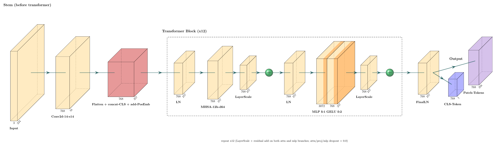
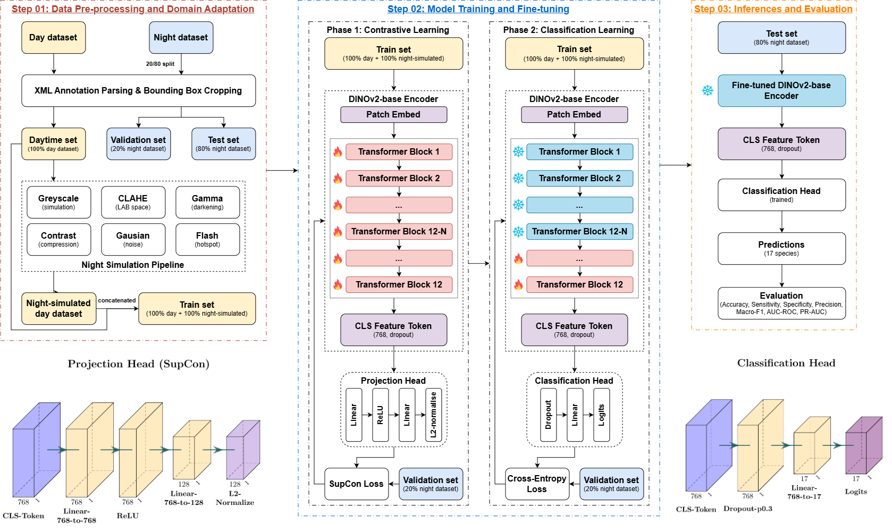

<div align="center">
  <h2>A Vision Transformer (ViT)-Based Domain Adaptation Framework for Day-to-Night Species Identification</h3>


</div>

A day-to-night domain-adaptive species identification pipeline built on `facebook/dinov2-base`. The model is trained exclusively on daytime camera-trap images and evaluated on nighttime images of the same species, without any nighttime labels being used during training.

## Table of Contents

- [Table of Contents](#table-of-contents)
- [Abstract](#abstract)
- [Project Description](#project-description)
  - [Key Components](#key-components)
  - [Project Goals](#project-goals)
- [Project Structure](#project-structure)
- [Installation](#installation)
  - [Data Installation](#data-installation)
  - [Repository Installation](#repository-installation)
- [Methodology](#methodology)
  - [Dataset Structure](#dataset-structure)
  - [Architecture](#architecture)
  - [Training Schedule](#training-schedule)
- [Running the Pipeline](#running-the-pipeline)
  - [Model training](#model-training)
  - [Inference webapp](#inference-webapp)
- [Results](#results)
  - [Evaluation Metrics](#evaluation-metrics)
  - [Output Files](#output-files)
- [Future Work](#future-work)
- [Contributing](#contributing)
- [License](#license)
- [Author](#author)
- [References](#references)


---

## Abstract

Camera-trap images collected at night differ substantially from daytime images in brightness, colour saturation, contrast, and noise characteristics. A model trained naively on daytime data often fails at night because it learns colour-dependent, illumination-specific features rather than species-level structural cues. This project presents a domain-generalisation pipeline built on a `facebook/dinov2-base` (ViT-B/14) backbone that closes this day-to-night gap through night-simulated data augmentation, supervised contrastive pretraining, and controlled partial fine-tuning. The classification results are evaluated on a 17-species camera-trap benchmark.

## Project Description

This pipeline addresses the day-to-night domain gap through three complementary mechanisms:

- **Data-level adaptation:** night-simulated augmented copies of daytime images are concatenated to the training set, exposing the model to illumination conditions closer to the test distribution.
- **Supervised Contrastive Loss:** a contrastive pretraining phase shapes the backbone toward species-discriminative, domain-robust representations before the classification head is attached.
- **Partial fine-tuning with controlled learning rates:** only the last N transformer blocks are unfrozen during fine-tuning with the classification head, protecting general low-level features learned during DINOv2 pretraining.

### Key Components

- **DINOv2 Backbone:** `facebook/dinov2-base` (ViT-B/14), fine-tuned for species classification.
- **Night Simulation:** an augmentation pipeline (CLAHE, desaturation, gamma darkening, noise, flash hotspot) that approximates nighttime conditions from daytime images.
- **Two-Phase Training Schedule:** optional SupCon contrastive pretraining phase followed by weighted cross-entropy fine-tuning.
- **Inference Webapp:** a FastAPI application for uploading an image and receiving top-5 species predictions.

### Project Goals

- Classify camera-trap species accurately at night despite training exclusively on daytime-labelled data.
- Quantify and close the domain gap using contrastive representation learning rather than requiring nighttime annotations.
- Provide a reproducible, config-driven pipeline covering training, evaluation, and inference.

## Project Structure

```plaintext
project-root/
├── app/
│   ├── app.py               # FastAPI inference server
│   └── index.html           # Inference webapp frontend
├── assets/                  # Image assets for README.md file
├── data/
│   ├── voc_day/             # Daytime images + Pascal VOC annotations (training)
│   └── voc_night/           # Nighttime images + Pascal VOC annotations (val/test)
├── outputs/                 # Checkpoints, logs, metrics, plots (created at runtime)
├── main.py                  # Single entry point: verify, train, evaluate
├── dataset.py               # Pascal VOC parser, dataset splits, MinKBatchSampler, class weights
├── data_adaptation.py       # Night-simulation transform pipeline
├── train.py                 # Dinov2Classifier, SupConLoss, training loop with phase schedule
├── evaluate.py              # Metrics computation, confusion matrix, PR-AUC plots
├── requirements.txt         # Python dependencies
└── README.md                # Project documentation
```

## Installation

### Data Installation

**1. Clone the repository:**

   ```bash
   git clone https://github.com/myyyyw/NTLNP.git
   cd NTLNP
   ```

**2. Run the downloader:**

   ```bash
   run './Download.sh'
   ```

### Repository Installation

**1. Clone the repository:**

   ```bash
   git clone https://github.com/<your-username>/<your-repo-name>.git
   cd <your-repo-name>
   ```

**2. Create a virtual environment:**

   ```bash
   python -m venv venv
   ```

   - **On macOS/Linux:**
     ```bash
     source venv/bin/activate
     ```
   - **On Windows:**
     ```bash
     venv\Scripts\activate
     ```

**3. Install the dependencies:**

   ```bash
   pip install -r requirements.txt
   ```

## Methodology

### Dataset Structure

```plaintext
data/
├── voc_day/
│   ├── Annotations/    (*.xml, Pascal VOC format)
│   └── JPEGImages/     (*.jpg)
└── voc_night/
    ├── Annotations/    (*.xml, Pascal VOC format)
    └── JPEGImages/     (*.jpg)
```

Each XML annotation provides the species label and a bounding box `(xmin, ymin, xmax, ymax)`, used to crop the image to the animal before resizing, removing domain-sensitive background.

**Split strategy**

| Split | Source | Size | Purpose |
|---|---|---|---|
| Train | voc_day | 100% | Model training |
| Val | voc_night | 20% | Checkpoint selection per epoch |
| Test | voc_night | 80% | Final evaluation after training |

### Architecture

**Backbone:** `facebook/dinov2-base` (ViT-B/14) with 12 transformer blocks, hidden dimension 768, patch size 14x14. Input images are resized to 224x224, divided into a 16x16 grid of patches (256 tokens), and prepended with a learnable `[CLS]` token. The `[CLS]` token from the final layer serves as the global image representation.

<div align="center" style="margin:0 0 28px;">
  
  <div style="margin-top:8px;"><sub>DINOv2 architecture</sub></div>
</div>

**Workflow:**

<div align="center" style="margin:0 0 28px;">
  
  <div style="margin-top:8px;"><sub>Overall pipeline workflow</sub></div>
</div>

### Training Schedule

**Without `--use_supcon` (baseline)**

| Phase | Epochs | Backbone | Trained parameters | Loss |
|---|---|---|---|---|
| 1 | 1 to `warmup_epochs` | Fully frozen | Classification head | Weighted CE |
| 2 | `warmup_epochs+1` to end | Last N blocks unfrozen | Last N blocks (lr x 0.02) + head (lr) | Weighted CE |

**With `--use_supcon`**

| Phase | Epochs | Backbone | Trained parameters | Loss |
|---|---|---|---|---|
| 1a | 1 to 5 | Fully frozen | Projection head only | SupCon |
| 1b | 6 to `warmup_epochs` | Fully unfrozen | Backbone (lr x 0.01) + projection head (lr) | SupCon |
| 2a | `warmup_epochs+1` to `warmup_epochs+5` | Fully frozen | Classification head only | Weighted CE |
| 2b | `warmup_epochs+6` to end | Last N blocks unfrozen | Last N blocks (lr x 0.02) + head (lr) | Weighted CE |

Phase 1a stabilises the projection head before the backbone receives any gradients. Phase 1b shapes the backbone representations toward species discriminability using contrastive loss. Phase 2a stabilises the randomly-initialised classification head before the backbone is partially unfrozen, and Phase 2b performs the final task-specific fine-tuning. The classification head is excluded from the optimiser during phases 1a/1b, and the projection head is excluded from Phase 2 onwards.

**Example allocation** (`--warmup_epochs 10 --epochs 30 --use_supcon`):

```
Phase 1a : epochs  1 -  5   (backbone frozen, projection head, SupCon loss)
Phase 1b : epochs  6 - 10   (full backbone, SupCon loss)
Phase 2a : epochs 11 - 15   (backbone frozen, classification head, CrossEntropy loss)
Phase 2b : epochs 16 - 30   (last N blocks, CrossEntropy loss)
```

If `warmup_epochs <= 5`, Phase 1b has zero epochs and the schedule collapses to: Phase 1a (all warmup_epochs), then Phase 2a, then Phase 2b.

## Running the Pipeline

### Model training

```bash
# Baseline (no adaptation)
python main.py

# With data adaptation
python main.py --use_data_adapt

# With supervised contrastive loss
python main.py --use_supcon

# Full configuration (both modules active)
python main.py \
  --use_data_adapt \
  --use_supcon \
  --epochs 30 \
  --warmup_epochs 10 \
  --finetune_blocks 3 \
  --batch_size 72 \
  --lr 1e-4 \
  --num_workers 4 \
  --data_root ./data
```

**All arguments**

| Argument | Default | Description |
|---|---|---|
| `--data_root` | `./data` | Root directory containing `voc_day/` and `voc_night/` data |
| `--epochs` | 30 | Total training epochs |
| `--warmup_epochs` | 15 | Number of allocated epochs for Phase 1 |
| `--finetune_blocks` | 3 | Number of trailing encoder blocks to unfreeze in Phase 2 |
| `--batch_size` | 76 | Batch size for training and evaluation |
| `--lr` | 1e-4 | Head learning rate |
| `--num_workers` | 4 | DataLoader worker processes (use 0 on Windows) |
| `--use_data_adapt` | off | Append night-simulated copies of daytime images to training |
| `--use_supcon` | off | Enable supervised contrastive learning schedule |

### Inference webapp

```bash
# Inference on best checkpoint stored in output
python app/app.py --checkpoint outputs/best_model_{timestamp}.pt
```

Once the server is running, open `http://localhost:8000` and follow the inference procedure on the web interface: upload a camera-trap image and receive the top-5 predicted species with confidence scores.

## Results

### Evaluation Metrics

Evaluation is run on the 80% test split of `voc_night` after training completes. The best checkpoint is selected by `val_night` macro-F1, evaluated after each epoch. With `--use_supcon`, only Phase 2 epochs are eligible for checkpointing, since the classification head is not trained before that point.

**Overall (macro-averaged):** accuracy, sensitivity (macro recall), specificity, precision, F1-score, AUC-ROC (one-vs-rest), PR-AUC (one-vs-rest).

**Per-species:** TP, TN, FP, FN counts; sensitivity, specificity, precision, accuracy, F1; AUC-ROC, PR-AUC.

The confusion matrix is row-normalised (fractions, not counts) so the diagonal represents per-class recall directly.

### Output Files

All output filenames include a datetime stamp `dd_mm_yy_hh_mm_ss` so successive runs never overwrite each other. All files are written to `./outputs/`.

| File | Description |
|---|---|
| `best_model_{ts}.pt` | Best checkpoint (model state, label map, args) |
| `label_map_{ts}.json` | Species name to index mapping |
| `train_log_{ts}.csv` | Per-epoch loss, accuracy, macro-F1, sub-phase label |
| `evaluation_report_{ts}.txt` | Human-readable metrics summary |
| `metrics_per_class_{ts}.csv` | Per-species metrics table |
| `confusion_matrix_{ts}.png` | Row-normalised confusion matrix heatmap |
| `confusion_matrix_{ts}.csv` | Raw confusion fractions |
| `pr_auc_{ts}.png` | Precision-recall curves (one per species + macro) |

## Future Work

Future improvements could include using self-supervised pre-training on unlabelled wildlife images, adding test-time adaptation, and extending the system to location-specific species priors so predictions reflect local ecology as well as image evidence. Another promising direction is sequence-level modelling, since camera traps often produce bursts of related frames and consensus or multi-image approaches can outperform single-image decisions in wildlife settings.

## Contributing

Contributions are welcome. If you'd like to improve this project, please fork the repository and submit a pull request.

## License

This project is licensed under the MIT License.

## Author

**Xuan Bach Nguyen**
-  Email: [xuan.b.nguyen@ucdconnect.ie](mailto:xuan.b.nguyen@ucdconnect.ie) and [bachnx1710@gmail.com](mailto:bachnx1710@gmail.com)
-  LinkedIn: [https://www.linkedin.com/in/xuan-bach-nguyen-178055368/](https://www.linkedin.com/in/xuan-bach-nguyen-178055368/)
-  Institution: University College Dublin, M.Sc. Data & Computational Science, 25206963

## References

1. Oquab, M., Darcet, T., Moutakanni, T., Vo, H., Szafraniec, M., Khalidov, V., ... & Bojanowski, P. (2023). Dinov2: Learning robust visual features without supervision. arXiv preprint arXiv:2304.07193.
2. Khosla, P., Teterwak, P., Wang, C., Sarna, A., Tian, Y., Isola, P., ... & Krishnan, D. (2020). Supervised contrastive learning. Advances in neural information processing systems, 33, 18661-18673.
3. Li, Y., Luo, Y., Zheng, Y., Liu, G., & Gong, J. (2024). Research on Target Image Classification in Low-Light Night Vision. Entropy, 26(10), 882.
4. Tan, M., Chao, W., Cheng, J.-K., Zhou, M., Ma, Y., Jiang, X., Ge, J., Yu, L., & Feng, L. (2022). Animal Detection and Classification from Camera Trap Images Using Different Mainstream Object Detection Architectures. Animals, 12(15), 1976.